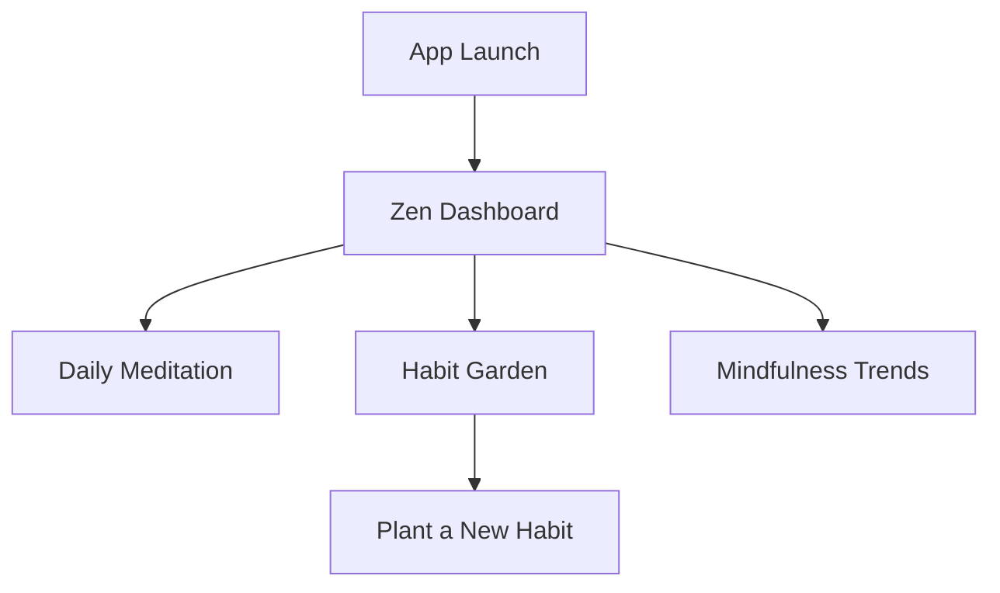

# PRD: ZenFlow - Mindful Habit Tracker

## 1. Vision & Purpose
ZenFlow isn't just another tracker; it's a digital sanctuary. We're building a mobile-first experience that rewards stillness and consistency, moving away from high-pressure "streak" metrics toward mindful progress.

## 2. Target Audience
Stressed professionals and students feeling overwhelmed by "productivity" apps that feel like a second job. They need a tool that feels like a deep breath.

## 3. Information Architecture (IA)

## 4. Design System & Aesthetics
- **Theme Name**: Ethereal Dawn
- **Core Colors**: 
    - **Mist Blue**: `hsl(210, 20%, 95%)` (Background)
    - **Sage Serenity**: `hsl(140, 15%, 45%)` (Primary Accents)
    - **Golden Hour**: `hsl(40, 80%, 70%)` (Action Buttons)
- **Typography Pairing**: **Outfit** (Headers) / **Inter** (Body)
- **Visual Style**: Soft Glassmorphism. Cards have a 10% white blur background with a subtle inner glow.

## 5. Key Features & Interaction Specs

### The "Habit Garden"
- **Description**: A visual representation of habits as growing plants.
- **Visuals**: A grid of floating glass cards, each holding a unique 3D-style plant illustration.
- **Animations**:
    - **Shimmer**: When loading the garden, the card outlines should pulse with a soft Mist Blue shimmer.
    - **Growth Animation**: When a habit is completed, the plant should have a subtle "bloom" animation (scale up 105% and back) with a particle puff.
- **Copy**: "Nurture your calm today." (Header) | "Keep growing" (CTA)

### Smart Insights
- **Description**: AI-driven summaries of mindfulness patterns.
- **Animations**:
    - **Streaming Text**: Insights should typewriter-in with a variable speed to mimic natural thought, using an opacity fade per character.
- **Copy**: "You tend to find your flow in the early morning. Why not try a 5-minute sit before your first meeting?"

## 6. Iconography & Illustrations
- **Style**: Soft, hand-drawn charcoal-style line art for empty states. Minimalist dual-tone icons for navigation.

## 7. Content Voice & Tone
- **Personality**: Zen Guardian (Calm, encouraging, non-judgmental).
- **Example Phrases**:
    - **Do**: "You've found five minutes of peace."
    - **Don't**: "YOU HAVE 5 MINUTES LEFT TO HIT YOUR GOAL OR LOSE YOUR STREAK!"

## 8. Success Metrics
- 30% increase in app retention after the first week.
- Average daily usage of 10 minutes (intentional engagement).
