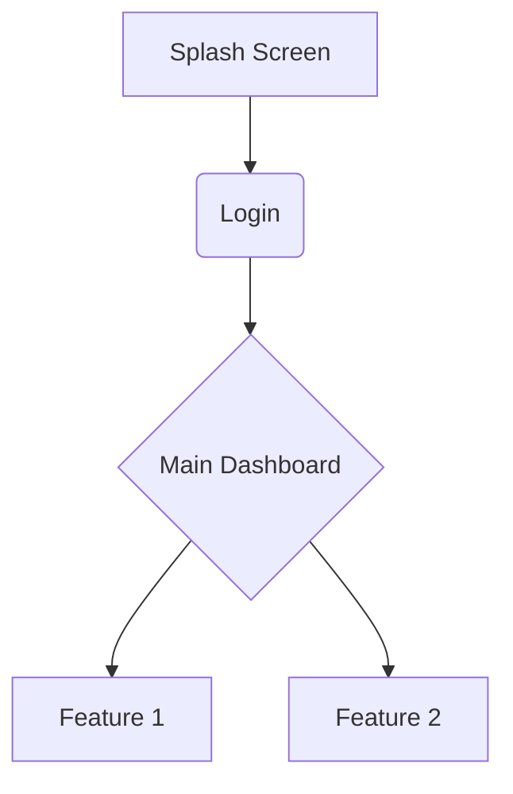

# PRD: [Project Name]

## 1. Vision & Purpose
*What are we building and why? Avoid generic AI filler.*

## 2. Target Audience
*Who is this for? Describe their pain points and aspirations.*

## 3. Information Architecture (IA)
*Visualize the app structure and user flow.*

## 4. Design System & Aesthetics
- **Theme Name**: [e.g., Solar Ember, Arctic Frost]
- **Core Colors**: [Color Name / HEX / HSL]
- **Typography Pairing**: [Header Font / Body Font]
- **Visual Style**: [e.g., Neumorphism, Glassmorphism, Brutalist]

## 5. Key Features & Interaction Specs

### [Feature 1 Name]
- **Description**: [Goal of the feature]
- **Visuals**: [How it looks]
- **Animations**:
    - [e.g., Shimmer loading on mount]
    - [e.g., Spring transition for list items]
- **Copy**: [Specific headlines, CTAs, or tooltips]

## 6. Iconography & Illustrations
- **Style**: [e.g., Thin-line icons, 3D isometric illustrations]
- **Source/Guideline**: [e.g., Lucide Icons, Custom Lottie animations]

## 7. Content Voice & Tone
- **Personality**: [e.g., Sarcastic Helper, Zen Guardian]
- **Example Phrases**:
    - [Good Phrase]
    - [Bad Phrase (to avoid AI slop)]

## 8. Success Metrics
- [Metric 1]
- [Metric 2]
