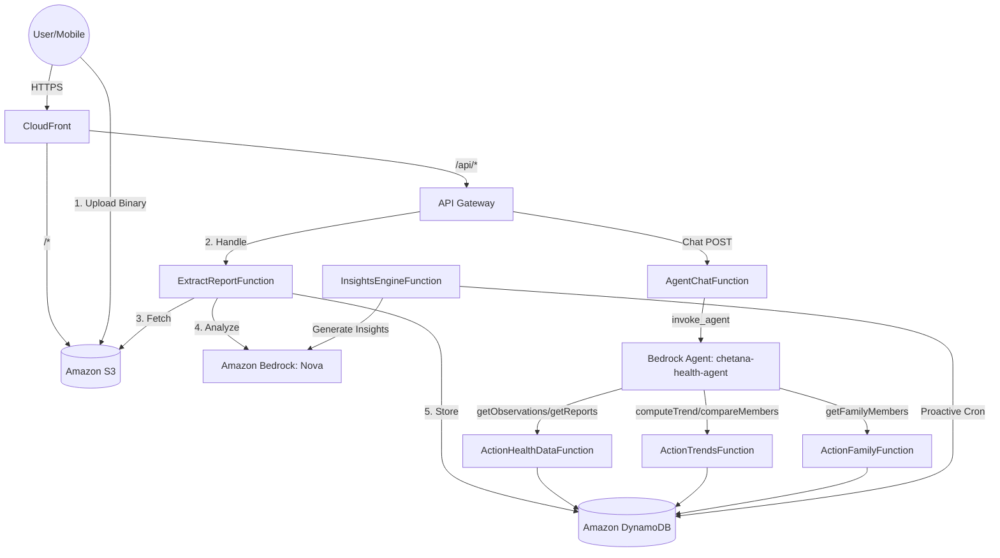

# MediAgent Architecture & Data Flow

MediAgent is built on a serverless, event-driven architecture designed for high-performance medical report extraction and agentic health insights.

## System Topology



---

## 3. Bedrock Agent: chetana-health-agent

### Agent Configuration

| Property | Value |
|---|---|
| **Agent ID** | `QKOQZAZT9C` |
| **Prod Alias ID** | `7MVGBJC3KY` |
| **Foundation Model** | Amazon Nova Pro 1.0 |
| **Region** | `us-east-1` |
| **Knowledge Base** | Medical guidelines KB (`JMI0YTDSGI`) |
| **Knowledge Base Purpose** | General clinical reference *only* (e.g. "what is a normal hemoglobin range?"). **Never** used for patient-specific data. |

### How the Chat Flow Works

1. Mobile/web sends `POST /families/{fid}/members/{mid}/chat` with `{ message, sessionId, language }`
2. `AgentChatFunction` calls `bedrock-agent-runtime.invoke_agent`, injecting `familyId` + `memberId` as **session attributes** and a mandatory per-request instruction via `promptSessionAttributes`
3. The Bedrock Agent orchestrates: it reads the instructions, picks the right action group function, and invokes the Lambda
4. The action group Lambda queries **DynamoDB directly** and returns structured JSON
5. The agent synthesizes the data into a natural-language reply and streams it back
6. `AgentChatFunction` assembles the streamed chunks and returns `{ reply, sessionId }`

> The `sessionId` is echoed back to the client and must be sent on subsequent turns to maintain conversation history server-side.

### Session Attributes

These are injected on every `invoke_agent` call in `agent_service.py` and are available in every action group Lambda via `event["sessionAttributes"]`:

| Attribute | Source | Purpose |
|---|---|---|
| `familyId` | URL path parameter | Scope all DynamoDB queries to the correct family |
| `memberId` | URL path parameter | Scope queries to the specific member being chatted with |
| `reportId` | Request body (optional) | If set, agent prioritises detail from this specific report |
| `language` | Request body (default: English) | Agent responds in the user's preferred language |

### Action Groups

Action groups are the agent's "tools" — functions it can call to fetch real patient data before answering.

> ⚠️ **Important**: Action groups must be manually registered with the agent via `backend/register_action_groups.py`. They are **not** automatically configured by SAM deploy.

#### 1. `chetana-action-health-data`
**Lambda**: `mediagent-ActionHealthDataFunction-NymM8yoEaZEe`
**Handler**: `lambdas/agent_chat/action_groups/health_data_actions.py`
**Purpose**: Core patient data retrieval — the primary action group for answering lab result questions.

| Function | Parameters | Description |
|---|---|---|
| `getReports` | `familyId`, `memberId` | Lists all uploaded lab reports for a member |
| `getObservations` | `familyId`, `memberId`, `loincCode`*, `testName`*, `fromDate`* | Fetches individual test values (e.g., hemoglobin). Resolves LOINC codes automatically and falls back to name-based search if code lookup returns empty. |
| `getReportDetail` | `familyId`, `memberId`, `reportId` | Returns full report with all observations inside it |

*optional

**LOINC Resolution Logic**: `getObservations` calls `loinc_mapping.find_loinc_code()` to convert natural language (e.g., "Hemoglobin") → LOINC code (e.g., `718-7`) before querying DynamoDB SK prefix `OBS#{memberId}#{loincCode}#`. If no results, falls back to case-insensitive name search across all member observations.

---

#### 2. `chetana-action-trends`
**Lambda**: `mediagent-ActionTrendsFunction-haaqPMZyvbmC`
**Handler**: `lambdas/agent_chat/action_groups/trend_actions.py`
**Purpose**: Time-series analysis, cross-member comparison, and pattern detection.

| Function | Parameters | Description |
|---|---|---|
| `computeTrend` | `familyId`, `memberId`, `loincCode`*, `testName`* | Returns direction (rising/falling/stable) based on last 3 readings |
| `compareMembers` | `familyId`, `memberIds` (comma-separated), `loincCode`*, `testName`* | Side-by-side latest value for a test across multiple members |
| `detectPatterns` | `familyId`, `memberId` | Scans all observations, surfaces abnormal + trending tests first |

---

#### 3. `chetana-action-family`
**Lambda**: `mediagent-ActionFamilyFunction-NgtU0gp6lQAK`
**Handler**: `lambdas/agent_chat/action_groups/family_actions.py`
**Purpose**: Profile discovery — lets the agent know who is in the family.

| Function | Parameters | Description |
|---|---|---|
| `getFamilyMembers` | `familyId` | Returns all members (name, age, relationship) in the family |

---

### Agent Instructions (Static — set in Agent Builder)

The full instruction set is in the Bedrock console under **Edit in Agent Builder → Instructions**. Key rules enforced:

1. **Always call action groups before answering** — never hallucinate health data from base model knowledge
2. **Use KB only for general reference** — never for patient-specific queries
3. **familyId + memberId are always available** — never ask the user for them
4. **Educational only** — no diagnosis, prescription, or medication recommendations
5. **LOINC code hints** — agent is given LOINC codes for common tests in the instructions

---

### Operational Runbook

#### After every `sam deploy`:
```bash
# Action group Lambda code is updated in-place (same ARN), so the
# Bedrock Agent automatically uses the new code — no re-registration needed.
# However, if you change function schemas or add new action groups:
cd backend
python register_action_groups.py
```

#### After `register_action_groups.py`:
1. Go to Bedrock Console → `chetana-health-agent` → **Aliases** tab
2. Click `prod` alias → Edit → **"Create new version and update alias"**
3. Save — this ensures the prod alias routes to the latest prepared DRAFT

#### CloudWatch Logs for action groups:
- `/aws/lambda/mediagent-ActionHealthDataFunction-NymM8yoEaZEe`
- `/aws/lambda/mediagent-ActionTrendsFunction-haaqPMZyvbmC`
- `/aws/lambda/mediagent-ActionFamilyFunction-NgtU0gp6lQAK`

#### If agent returns "insufficient data" / ignores action groups:
1. Check trace in Bedrock Console → test the agent → enable **"Show trace"**
2. If trace shows `knowledgebase_search` instead of action group calls → static agent instructions need updating and re-prepare
3. If action groups show empty results → check Lambda logs and DynamoDB data with the member's `familyId`/`memberId`
4. If action groups never appear in trace → run `python register_action_groups.py` again

## Core Processing Flows

### 1. Medical Report Extraction (10-20 Seconds)
We use a high-performance **Presigned URL** pattern to bypass API Gateway limits:
1. **Provision**: Mobile requests a signed S3 URL via `/reports/upload-url`.
2. **Direct PUT**: Mobile streams binary data directly to S3 (supports PNG, JPEG, WebP, PDF).
3. **Signal**: Mobile calls `/reports/upload` with the S3 key.
4. **Extraction**:
    *   `ExtractReportFunction` fetches file bytes.
    *   Calls **Amazon Nova Pro/Lite** with multimodal capabilities.
    *   Nova extracts Lab Name, Date, and a list of Test Results.
    *   Lambda maps results to **LOINC codes** and calculates abnormal reference ranges.
5. **Persistence**: Saves a hierarchical `REPORT` item and multiple `OBS` (Observation) items to DynamoDB.

### 2. Proactive Insights Engine
*   **Trigger**: Can be manual (via UI) or scheduled (EventBridge Cron).
*   **Logic**: Scans the last 30 days of observations for a family member.
*   **AI Synthesis**: Generates `InsightCard` (Summary + Severity) and `FollowUp` (Next steps) items.
*   **Persistence**: Stored with `INSIGHT#` and `FOLLOWUP#` prefixes for instant retrieval.

## Data Organization (Single-Table Design)

We use **DynamoDB** with a strictly hierarchical Sort Key (SK) structure to ensure high performance and data locality:

| Resource | Partition Key (PK) | Sort Key (SK) |
| :--- | :--- | :--- |
| **Family** | `FAMILY#{fid}` | `META` |
| **Member** | `FAMILY#{fid}` | `MEMBER#{mid}` |
| **Report** | `FAMILY#{fid}` | `REPORT#{mid}#{date}#{id}` |
| **Observation** | `FAMILY#{fid}` | `OBS#{mid}#{loinc}#{date}#{id}` |
| **Insight** | `FAMILY#{fid}` | `INSIGHT#{mid}#{date}#{id}` |
| **FollowUp** | `FAMILY#{fid}` | `FOLLOWUP#{mid}#{date}#{id}` |

## Observability & Debugging

### Where to check Logs? (AWS CloudWatch)
*   **Report Processing**: `/aws/lambda/mediagent-ExtractReportFunction`
*   **Insights Generation**: `/aws/lambda/mediagent-InsightsEngineFunction`
*   **AI Chat (Sanctuary)**: `/aws/lambda/mediagent-AgentChatFunction`
*   **General Management**: `/aws/lambda/mediagent-FamilyManagementFunction`

### Where to check Data/Output?
1.  **Web App**:
    *   **Trends Tab**: Shows all `OBS` (Observation) records extracted.
    *   **Insights Tab**: Shows generated AI `InsightCards`.
    *   **History**: Shows the list of `REPORT` objects.
2.  **API**: Use the Postman collection to query `GET .../observations` or `GET .../insights`.
3.  **DynamoDB Console**: Look for items in the `mediagent-HealthData` table using the PK/SK patterns above.

## Code Standards
*   **Runtime**: Python 3.12 (Serverless)
*   **Architectural Pattern**: Service-Repository (isolates Boto3 calls from business logic).
*   **Metadata**: Every item includes a `meta` block with `version`, `createdAt`, `updatedAt`, and `isDeleted` for robust soft-delete and optimistic locking.
