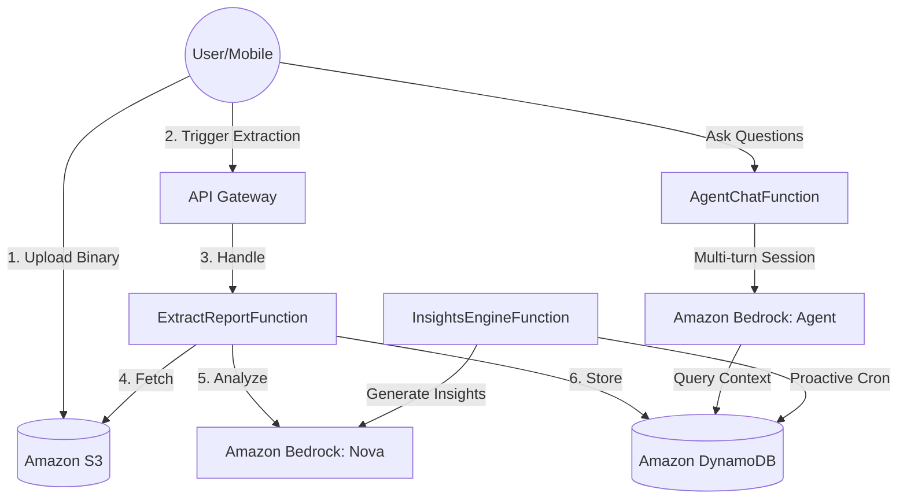

# MediAgent Architecture & Data Flow

MediAgent is built on a serverless, event-driven architecture designed for high-performance medical report extraction and agentic health insights.

## System Topology

## Core Processing Flows

### 1. Medical Report Extraction (10-20 Seconds)
We use a high-performance **Presigned URL** pattern to bypass API Gateway limits:
1. **Provision**: Mobile requests a signed S3 URL via `/reports/upload-url`.
2. **Direct PUT**: Mobile streams binary data directly to S3 (supports PNG, JPEG, WebP, PDF).
3. **Signal**: Mobile calls `/reports/upload` with the S3 key.
4. **Extraction**:
    *   `ExtractReportFunction` fetches file bytes.
    *   Calls **Amazon Nova Pro/Lite** with multimodal capabilities.
    *   Nova extracts Lab Name, Date, and a list of Test Results.
    *   Lambda maps results to **LOINC codes** and calculates abnormal reference ranges.
5. **Persistence**: Saves a hierarchical `REPORT` item and multiple `OBS` (Observation) items to DynamoDB.

### 2. Proactive Insights Engine
*   **Trigger**: Can be manual (via UI) or scheduled (EventBridge Cron).
*   **Logic**: Scans the last 30 days of observations for a family member.
*   **AI Synthesis**: Generates `InsightCard` (Summary + Severity) and `FollowUp` (Next steps) items.
*   **Persistence**: Stored with `INSIGHT#` and `FOLLOWUP#` prefixes for instant retrieval.

## Data Organization (Single-Table Design)

We use **DynamoDB** with a strictly hierarchical Sort Key (SK) structure to ensure high performance and data locality:

| Resource | Partition Key (PK) | Sort Key (SK) |
| :--- | :--- | :--- |
| **Family** | `FAMILY#{fid}` | `META` |
| **Member** | `FAMILY#{fid}` | `MEMBER#{mid}` |
| **Report** | `FAMILY#{fid}` | `REPORT#{mid}#{date}#{id}` |
| **Observation** | `FAMILY#{fid}` | `OBS#{mid}#{loinc}#{date}#{id}` |
| **Insight** | `FAMILY#{fid}` | `INSIGHT#{mid}#{date}#{id}` |
| **FollowUp** | `FAMILY#{fid}` | `FOLLOWUP#{mid}#{date}#{id}` |

## Observability & Debugging

### Where to check Logs? (AWS CloudWatch)
*   **Report Processing**: `/aws/lambda/mediagent-ExtractReportFunction`
*   **Insights Generation**: `/aws/lambda/mediagent-InsightsEngineFunction`
*   **AI Chat (Sanctuary)**: `/aws/lambda/mediagent-AgentChatFunction`
*   **General Management**: `/aws/lambda/mediagent-FamilyManagementFunction`

### Where to check Data/Output?
1.  **Web App**:
    *   **Trends Tab**: Shows all `OBS` (Observation) records extracted.
    *   **Insights Tab**: Shows generated AI `InsightCards`.
    *   **History**: Shows the list of `REPORT` objects.
2.  **API**: Use the Postman collection to query `GET .../observations` or `GET .../insights`.
3.  **DynamoDB Console**: Look for items in the `mediagent-HealthData` table using the PK/SK patterns above.

## Code Standards
*   **Runtime**: Python 3.12 (Serverless)
*   **Architectural Pattern**: Service-Repository (isolates Boto3 calls from business logic).
*   **Metadata**: Every item includes a `meta` block with `version`, `createdAt`, `updatedAt`, and `isDeleted` for robust soft-delete and optimistic locking.
