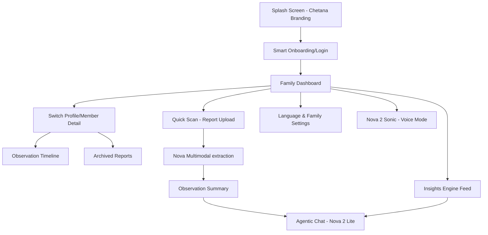

# PRD: Chetana (चेतना) — Mobile Frontend

> **Vision**: "Awaken to your health." Chetana is a mobile-first, AI-powered sanctuary for health record management, designed for Indian families to engage with their medical data through vision, voice, and vernacular insights.

## 1. Vision & Purpose
Chetana transforms fragmented medical reports into a unified, living health narrative. It bridges the gap between complex lab data and patient understanding by using Amazon Nova's multimodal capabilities to extract, reason, and converse in the user's preferred language.

## 2. Target Audience
- **The "Family Guardian"**: Sons and daughters managing health records for elderly parents.
- **Chronic Condition Warriors**: Individuals tracking long-term trends (Diabetic, Thyroid, etc.).
- **Health-Conscious Individuals**: People seeking proactive insights without clinical complexity.

## 3. Information Architecture (IA)

## 4. Design System & Aesthetics: "Ethereal Obsidian"

### Theme Tokens
- **Background**: `Obsidian Abyss` — `hsl(220, 20%, 5%)`
- **Primary Accent**: `Chetana Teal` — `hsl(175, 100%, 45%)` (Energy & Vitality)
- **Secondary Accent**: `Solar Amber` — `hsl(45, 95%, 60%)` (Alerts & Warnings)
- **Surface**: `Glass Overlay` — `hsla(220, 15%, 15%, 0.7)` with 20px blur.

### Typography
- **Headlines**: `Outfit` (Bold, Modern, Data-centric)
- **Body**: `Inter` (Readable, Clean)

### Illustrations & Iconography
- **Style**: **"Digital Humanism"**.
- **Resources**:
    - **Illustrations**: Leverage **Storyset (Rafiki style)** for empty states (e.g., "No reports yet") and onboarding steps. Color-customize to match `Chetana Teal`.
    - **Icons**: Use **Iconmonstr (Bold/Rounded set)** for navigation and status indicators.
    - **Empty States**: A custom Storyset illustration of a doctor helping a patient, with a soft glassmorphic background.

## 5. Key Features & Micro-interactions

### 1. The "Smart Pulse" Dashboard
- **Visuals**: A central glassmorphic card for each family member showing their latest "Vitals Loop".
- **Animations**:
    - **Shimmer**: Cards should shimmer with a `Chetana Teal` gradient while fetching `/families/{id}/members`.
    - **Entrance**: Cards slide up with a staggered delay (100ms per card) using a `cubic-bezier(0.2, 0.8, 0.2, 1)`.

### 2. Nova Multi-Scan (Report Upload)
- **Interaction**: Based on `android_guidelines.md`, uses binary streaming to S3.
- **Animations**:
    - **Progress Bar**: A smooth, continuous wave animation (sine wave) tracking the upload percentage.
    - **Extraction Reveal**: Once Nova Multimodal starts processing, show a "Scanning Beam" animation over a translucent preview of the report.
    - **Result Pop**: Results should "bloom" into view once the 5-15s extraction completes.

### 3. Voice Sanctuary (Nova 2 Sonic)
- **Interaction**: Native bidirectional audio in Hindi/English.
- **Visuals**: A dynamic, fluid waveform visualizer that reacts to the amplitude of the audio stream.
- **Copy**: "I'm listening, Rahul. You can ask me anything about your father's labs."

### 4. Insight Stream
- **Animations**:
    - **Typewriter Streaming**: AI-generated insights stream in character-by-character with a variable delay to feel human.
    - **Citation Chips**: Clickable chips that "spring" out from the text, linking back to the original source image.

## 6. Android Implementation Guidelines
- **Networking**: `OkHttp` with `ProgressBar` listeners for S3 PUT requests.
- **Charts**: `MPAndroidChart` for `/observations` timeline.
- **Citations**: "Citation Chips" below chat bubbles as defined in `android_guidelines.md`.

## 7. Content Voice & Tone
- **Personality**: The Wise Companion (Calm, Expert, Vernacular-First).
- **Anti-AI Slop Rules**:
    - Never say: "In today's digital landscape..."
    - Say: "Your hemoglobin levels are slightly lower than last month. Let's look at your diet."
    - Use Hindi/Sanskrit terms where appropriate (e.g., *Chetana*, *Swasthya*) to build cultural trust.

## 8. Success Metrics
- **Extraction Accuracy**: 95%+ for Indian lab formats (Quest, Apollo, etc.).
- **Voice Engagement**: 40%+ of Hindi users opting for Sonic over text chat.
- **Family Retention**: 3+ family members tracked per account.
