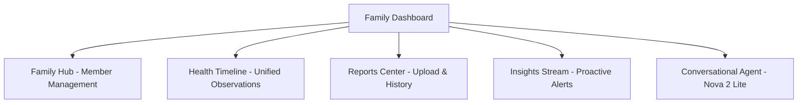

# PRD: Chetana (चेतना) — Patient Portal (Web)

> **Vision**: "Awaken to your health." Chetana is a digital sanctuary for health management. This Web PRD is strictly derived from the core [MediAgent PRD](file:///c:/Users/Dipmala/Documents/Code/medi-agent/docs/prd2.md) and [OpenAPI Spec](file:///c:/Users/Dipmala/Documents/Code/medi-agent/docs/openapi.yml).

## 1. Vision & Purpose
The Chetana Portal provides a desktop-class "Command Center" for a family's health. It focuses on clarity, empathy, and data-driven insights, moving away from gamified "scores" towards clinical transparency and "Digital Humanism".

## 2. Information Architecture (IA)

## 3. Design System: "Ethereal Obsidian" (Digital Humanism)

### Aesthetics
- **Core Principle**: **"No Slop"**. Avoid generic placeholders, low-contrast text, or unnecessary animations. Every visual element must serve a data-driven purpose.
- **Glassmorphism**: Use `hsla(220, 15%, 15%, 0.7)` with `20px` blur. Border: `1px solid hsla(210, 100%, 100%, 0.1)`.
- **Glows**: Subtle, data-reactive glows. 
    - *Urgent Insight* = Solar Amber outer glow.
    - *Stable Trend* = Healing Green inner glow.

### Typography & Icons
- **Headers**: `Outfit` (Modern, Bold).
- **Body**: `Inter` (Precise, Readable).
- **Icons**: **Iconmonstr (Rounded)**. No thin, clinical icons; use friendly, bold glyphs.

## 4. Feature Specifications (Strict Alignment)

### 1. Family Hub Dashboard (GET /families/{id}/members)
- **Visuals**: A grid of member avatars. Clicking a member switches the global context.
- **Micro-interaction**: Active member card has a broad, soft teal shadow.

### 2. Proactive Insights Engine (GET /insights)
- **Strict Rule**: Insights must follow the `INSIGHT#` schema from `prd2.md`.
- **Severity States**:
    - **Urgent (🚨)**: Solar Amber text + soft orange pulse.
    - **Attention (⚠️)**: Healing Green text.
    - **Informational (ℹ️)**: Obsidian/Teal text.
- **Streaming**: Nova 2 Lite response streaming as described in the Mobile PRD (Typewriter effect).

### 3. Unified Observations Timeline (GET /observations)
- **Visuals**: A high-fidelity trend line (using SVG/Chart.js) for specific LOINC codes (e.g., Glucose).
- **Parity**: Must show `normalLow` and `normalHigh` reference bands as per the OpenAPI spec.

### 4. Report Center (GET /reports)
- **Async Flow**: Show "Processing" state with a scanning beam animation while Nova Lite extracts data.
- **Extraction Accuracy**: Clearly highlight abnormal values (`isAbnormal: true`).

### 5. Voice Sanctuary (Nova 2 Sonic)
- **Interaction**: A floating sanctuary button that opens a native audio visualizer (fluid waveform).

## 5. "Anti-AI Slop" Guidelines
- **Copy**: No "Here is what I found" or "As an AI assistant". Use direct, supportive language: *"Rahul, your father's glucose levels have stabilized over the last two tests."*
- **Visuals**: No generic stock imagery. Use **Storyset (Rafiki)** illustrations that are color-matched to `Chetana Teal`.
- **Latency**: Use shimmers only during actual network fetch calls.
