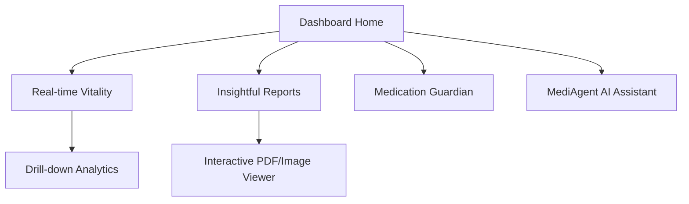

# PRD: MediAgent - Pulse Dashboard (Patient Portal)

## 1. Vision & Purpose
The Pulse Dashboard is the front-line of the MediAgent experience. It transforms cold medical data into a warm, actionable health narrative. Our goal is to empower users with a "living" health summary that feels supportive, not clinical.

## 2. Target Audience
Patients managing chronic conditions or health-conscious individuals who want a clearer picture of their vitals, medications, and labs without wading through complex reports.

## 3. Information Architecture (IA)

## 4. Design System & Aesthetics
- **Theme Name**: Clinical Vitality
- **Core Colors**: 
    - **Obsidian Deep**: `hsl(220, 15%, 10%)` (Dark mode background)
    - **Neon Pulse**: `hsl(190, 100%, 50%)` (Primary Interactive/Vitals)
    - **Healing Green**: `hsl(150, 60%, 45%)` (Healthy status/Stable vitals)
- **Typography Pairing**: **Outfit** (Data-heavy headers) / **Inter** (Instructional body)
- **Visual Style**: Glassmorphism with **High Contrast**. Vital cards should have a subtle background glow corresponding to the "Health Status" (Green = Stable, Amber = Warning).

## 5. Key Features & Interaction Specs

### 1. Vitality Pulse Loop
- **Description**: A central, animated ring showing the user's "Daily Vital Score".
- **Visuals**: A gradient-filled ring that "breathes" (slowly expands and retracts).
- **Animations**:
    - **Pulse Animation**: The ring should have a subtle "heartbeat" pulse effect (100ms scale up, 400ms scale down).
    - **Shimmer**: Data points within the vitals list should shimmer while fetching from the AWS Lambda backend.
- **Copy**: "Your pulse today is steady. Excellent work." | "View Detailed Trends" (CTA)

### 2. Insight Stream (AI Assistant)
- **Description**: A dynamic feed of health insights generated by the MediAgent AI.
- **Animations**:
    - **Streaming Text**: AI insights must stream in with a "text-drop" animation (each word drops in from 5px above with a slight fade).
- **Copy**: No generic "AI-speak". 
    - **Do**: "Your sleep quality improved by 12% after you adjusted your medication time. Keep it up!"
    - **Don't**: "Based on the data provided, it appears that your sleep patterns are showing a significant improvement."

### 3. Report Interactive Cards
- **Description**: Summary cards for uploaded lab reports.
- **Interaction**: Clicking a card expands it with a "spring-pop" transition.
- **Copy**: "New Labs: Blood Panel (March 12)" | "Scan for Insights" (Action)

## 6. Iconography & Illustrations
- **Style**: 3D-effect frosted glass icons for the main navigation. Custom Lottie animations for "Success" states (e.g., when a medication is logged).

## 7. Content Voice & Tone
- **Personality**: The Wise Companion (Expert, empathetic, concise).
- **Tagline**: "Your health, articulated."

## 8. Success Metrics
- 50% reduction in user confusion regarding lab results (measured by follow-up chat volume).
- 90% "Actionable" rating on AI-generated insights.
